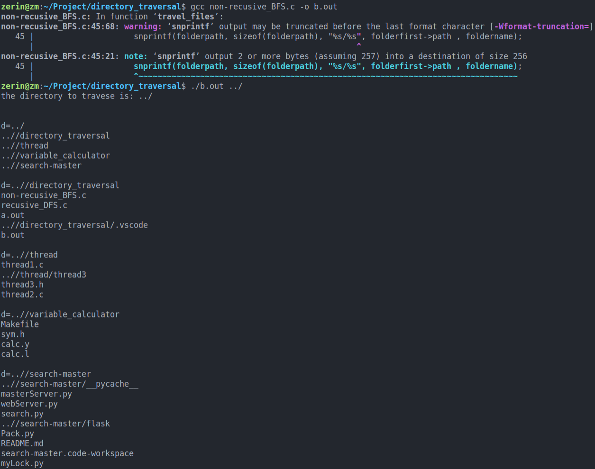
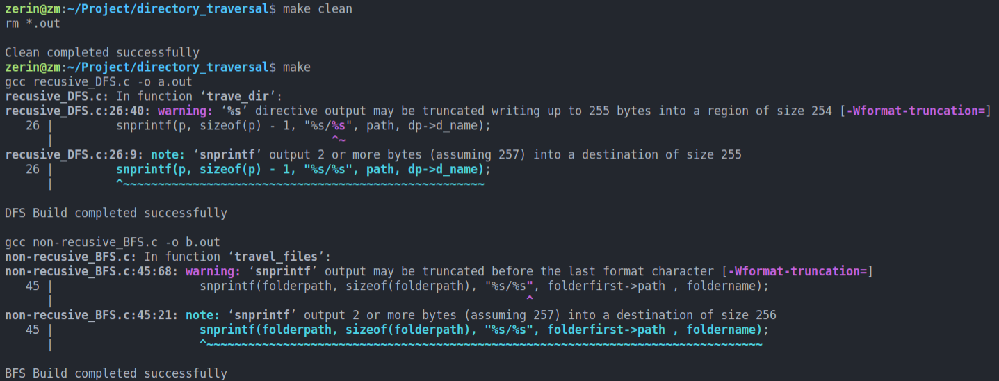

#### 一、环境配置

Ubuntu20.04.1

VSCode+gcc

#### 二、DFS遍历目录(递归)

##### 1.Usage:

gcc recusive_DFS.c -o a.out	//或make
./a.out path(自定义目录)		 //或./a.out(默认路径)

##### 2.函数说明

###### (1)trave_dir函数

创建指针d指向DIR 以保存当前正在被读取的目录的有关信息
创建dp指针指向dirent 保存readdir函数的返回值
创建stat结构体对象 存放获取到的文件名为d_name的文件的详细信息

判断路径是否合法

使用opendir函数打开目录path，返回指向目录path的DIR结构体d

在while循环中
读取前 将"." ".."略过, 避免死循环
调用readdir(d)函数 读取目录path下所有文件和目录，返回指向目录path下所有文件的dirent结构体，调用stat（p, &st）来获取每个文件的详细信息，存储在stat结构体中，将其输出

###### (2)main函数

如果传递给main函数的参数个数小于2, 以默认路径(../)运行
否则以自定义目录运行

###### (3)运行结果

#### 三、BFS遍历目录(非递归)

##### 1.Usage

gcc non-recusive_BFS.c -o b.out	//或make
./b.out path(自定义目录)				 //或./b.out(默认路径)

##### 2.函数说明

###### (1)travel_files函数

创建指针d指向DIR 以保存当前正在被读取的目录的有关信息
创建dp指针指向dirent 保存readdir函数的返回值

while循环中
读取前 将"." ".."略过, 避免死循环
readdir读取文件目录名, 根据其返回值的不同, 进行不同的处理
当dp->type为DT_REG时:
直接输出常规文件的文件名
当dp->type为DT_DIR时:
将foldername和folderpath中的字节清除以便存放下个文件的信息
输出文件夹路径

strncpy函数将dp中的name复制到foldername中
新建一个文件夹节点, 将当前文件信息节点放到链表中
将当前指针后移一次, 便于进行下一轮操作

###### (2)main函数

如果传递给main函数的参数个数小于2, 以默认路径(../)运行
否则以自定义目录运行

###### (3)运行结果

使用make时

